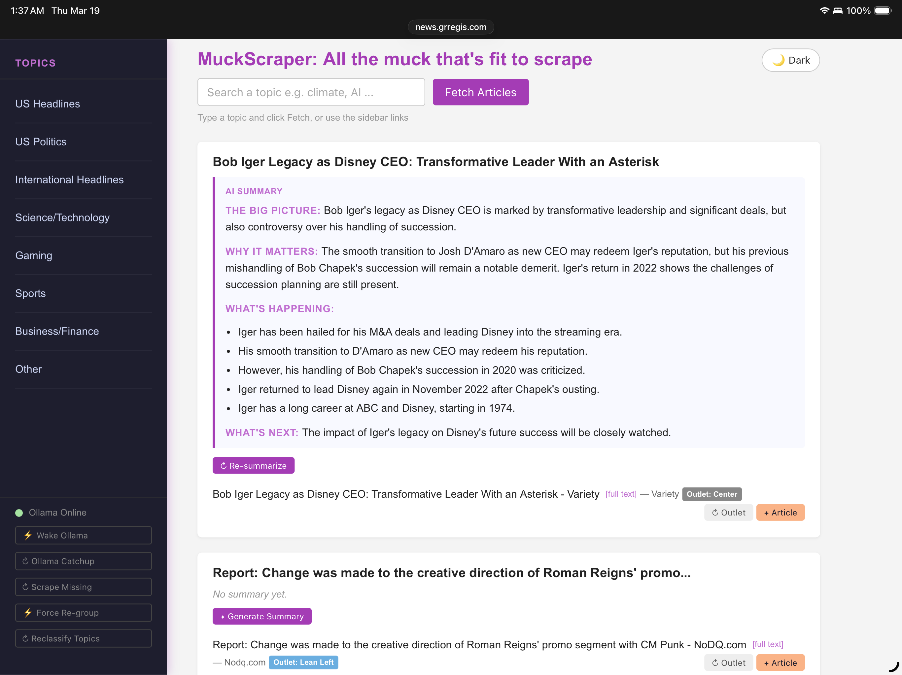
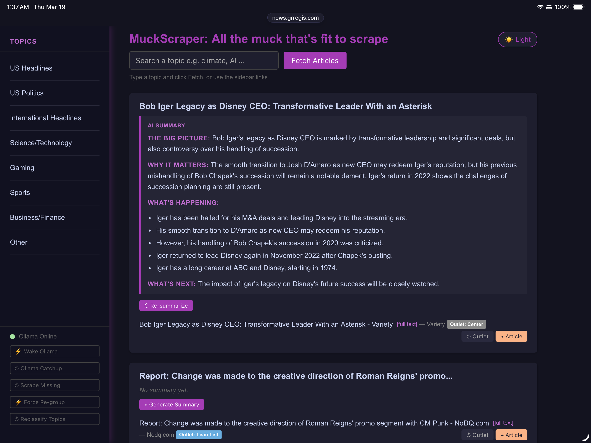
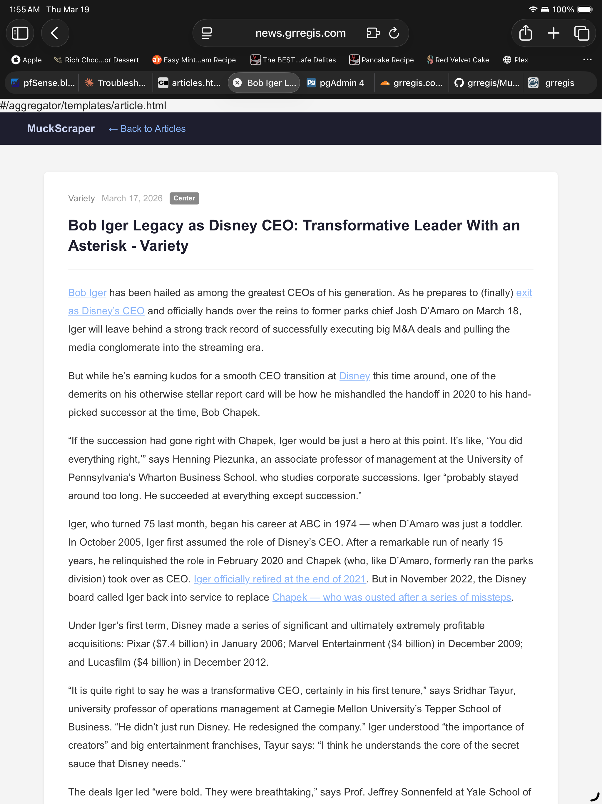
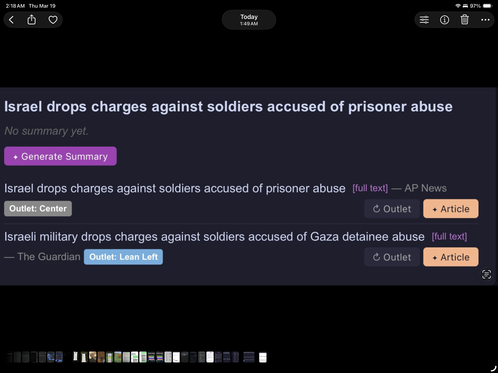

# MuckScraper — All the Muck That's Fit to Scrape

### A Self-Hosted News Aggregator with LLM Analysis

> **TL;DR:** MuckScraper pulls news from multiple sources, groups articles about the same story together using vector embeddings, scores every outlet for political bias, and gives you a Smart Brevity AI summary — all running on your own hardware with no subscriptions, no tracking, and no algorithm deciding what you see.

---

## Screenshots

### Light Mode


### Dark Mode


### Full Article Reader


### Bias Scoring


---

## Why This Is Different

Most news aggregators just show you a firehose of headlines. MuckScraper does three things no other self-hosted tool does:

**Cross-outlet story clustering** — Articles from CNN, Fox News, Reuters, and AP covering the same event are automatically grouped into a single story using vector embeddings and semantic similarity. See how different outlets cover the same story side by side.

**Political bias scoring** — Every outlet is scored on a 1–5 left-to-right spectrum by your local LLM the first time it appears. Individual articles can be rated separately. No hardcoded bias lists — your LLM makes the call based on its own knowledge.

**Smart Brevity summaries** — On-demand AI summaries follow the Axios Smart Brevity format: The big picture, Why it matters, What's happening, and What's next. Tight, structured, and actually readable.

---

## What It Does

MuckScraper pulls news from multiple APIs across configurable topic categories on a 3-hour schedule. Articles are scraped for full text, classified into topics by an LLM, grouped into stories using vector similarity, scored for political bias, and displayed in a clean web interface with dark mode support. Generate AI summaries on demand, rate individual articles for bias, and read full scraped article text — all from your own server.

---

## Tech Stack

- **Backend:** Python, Flask, SQLAlchemy
- **Database:** PostgreSQL with pgvector
- **News Data:** NewsAPI + GNews (configurable)
- **LLM:** Any Ollama-compatible model, or adaptable to OpenAI/Anthropic APIs
- **Embeddings:** nomic-embed-text via Ollama
- **Scraping:** BeautifulSoup, Playwright, readability-lxml, archive.ph fallback
- **Containerization:** Docker, Docker Compose

---

## Project Structure
```
muckscraper/
├── aggregator/
│   ├── __init__.py                       # Flask app factory, routes
│   ├── app.py                            # App entry point
│   ├── models.py                         # Database models
│   └── templates/
│       ├── articles.html                 # Main UI template
│       └── article.html                  # Full article reader
├── news_fetcher/
│   ├── fetch_and_store_articles.py       # Core ingestion logic
│   ├── headline_generator.py             # Generates headlines for multi-artilce stories
│   ├── scheduler.py                      # 3-hour fetch scheduler
│   ├── scraper.py                        # Web scraper with fallbacks
│   ├── story_grouper.py                  # Vector embedding story clustering
│   ├── topic_classifier.py               # LLM topic classification
│   ├── summarizer.py                     # Smart Brevity summarization
│   ├── outlet_bias_llm.py                # Political bias scoring
│   └── Dockerfile                        # Scheduler container build
├── docker-compose.yml
├── Dockerfile                            # App container build
├── requirements.txt
├── .env.sample
├── restart.sh                            # Soft rebuild, keeps DB
└── README.md
```
---

## ⚠️ Security Warning

MuckScraper has **no built-in authentication**. Any user who can reach the app on your network can trigger fetches, generate summaries, and read all stored articles.

**Do not expose MuckScraper directly to the internet.**

Recommended safe deployment options:
- Run on a local network only (default)
- Put it behind a VPN (e.g. WireGuard, Tailscale)
- Use a reverse proxy with authentication (e.g. Nginx + Authelia, Caddy + basic auth)

Authentication is planned for a future release.

---

## Requirements

- Docker and Docker Compose
- NewsAPI key (free tier: 100 requests/day)
- GNews API key (free tier: 100 requests/day)
- Ollama running on your network with:
  - A chat model (e.g. `llama3.1`, `mistral`)
  - An embedding model (`nomic-embed-text`)

---

## Installation
```bash
git clone https://github.com/grregis/muckscraper.git
cd muckscraper
cp .env.sample .env
# Edit .env with your API keys and Ollama host
docker compose up --build
```

Then open `http://localhost:5000` in your browser.

---

## Current Features

### News Fetching
- Scheduled fetching every 3 hours across 7 topic categories
- On-demand fetch via the web interface — by topic or custom search query
- Dual API sources — NewsAPI and GNews fetched for every topic
- Smart restart timer — skips fetch on startup if last fetch was less than 3 hours ago
- Duplicate article detection
- Source and title keyword blocklist

### Article Scraping
- Full article text scraped automatically on fetch
- BeautifulSoup + readability-lxml for content extraction
- Playwright fallback for JavaScript-heavy sites
- Googlebot user agent fallback for soft-paywalled sites
- archive.ph fallback as last resort
- Per-article [scrape] button and global ↻ Scrape Missing button

### Topic Classification
- LLM-powered topic classification — articles are classified by content, not by which API fetched them
- Topics: US Headlines, US Politics, International Headlines, Science/Technology, Gaming, Sports, Business/Finance
- Articles can belong to multiple topics
- ↻ Reclassify Topics button to reclassify all articles with updated logic

### Political Bias Scoring
- Outlet-level bias scoring via LLM on a 1–5 scale (1=Left, 5=Right)
- Scores assigned automatically when a new outlet is first seen
- Retry mechanism for outlets that failed while LLM was offline
- Manual re-rank button to re-score any outlet on demand
- Per-article bias rating separate from outlet score

### Story Grouping
- Vector embedding-based story clustering using pgvector and nomic-embed-text
- Articles matched to existing stories using cosine similarity
- Automatic re-grouping when Ollama comes back online
- ⚡ Force Re-group button to rebuild all story groupings from scratch

### LLM Summarization
- On-demand Smart Brevity summaries: The big picture, Why it matters, What's happening, What's next
- Auto-summarization when Ollama reconnects
- Re-summarize button to regenerate at any time

### Web Interface
- Clean UI with dark/light mode toggle (preference saved in browser)
- Sticky sidebar with topic navigation
- Pagination — 25 stories per page
- Color-coded bias tags (blue = left, red = right, grey = center)
- Full article reader at `/article/<id>` showing scraped HTML content
- Ollama online/offline status indicator

### AI-Generated Story Headlines
- Wire service style headlines generated by Ollama for multi-article stories
- Who/what/where in one line, 15 words max
- Generated automatically when a second article is added to a story
- Generated during Ollama Catchup for existing grouped stories
- Falls back to auto-generated title for single-article stories
- "AI headline" label shown next to generated headlines in the UI

### Single-Article Story Filter
- Toggle on the main page to hide single-article stories
- Focus on stories covered by multiple outlets — the most newsworthy content
- Default is off — all stories shown unless filter is enabled
- Filter state preserved in the page URL for easy bookmarking

---

## Customization

### Topics / Categories
Edit the `TOPICS` list in `aggregator/__init__.py` and the `SCHEDULED_FETCHES` list in `news_fetcher/scheduler.py`.

### News API Provider
The fetching logic lives in `news_fetcher/fetch_and_store_articles.py`. Swap out the API client for any provider that returns article titles, URLs, content snippets, and source names.

### LLM Provider
LLM calls are isolated in these files:
- `news_fetcher/outlet_bias_llm.py` — bias scoring
- `news_fetcher/summarizer.py` — summarization
- `news_fetcher/topic_classifier.py` — topic classification
- `news_fetcher/story_grouper.py` — story matching

### Blocked Sources
Add domains or title keywords to `BLOCKED_SOURCES` and `BLOCKED_TITLE_KEYWORDS` in `news_fetcher/fetch_and_store_articles.py`.

---

## Maintenance Scripts

| Script | Purpose |
|--------|---------|
| `./restart.sh` | Soft rebuild — clears cache, rebuilds images, keeps database |

---

## Roadmap

### Planned Features

#### Infrastructure
- User authentication (Flask-Login)
- Production WSGI server support
- Wake on LAN via pfSense API

#### Story & Coverage Analysis
- Coverage frequency display per story
- Visual bias spectrum showing which outlets covered each story

#### Improved Accuracy
- Topic classification prompt tuning
- pgvector similarity threshold tuning
- Periodic outlet re-scoring

#### Paywall Bypass
- RSS feed extraction for outlets that publish full text in feeds

#### Admin Interface
- Manual bias score overrides
- Outlet management (view, edit, delete)
- Blocked sources management via UI

#### UI
- Responsive mobile layout

---

## ⚠️ Known Limitations

- Development server only — not production hardened
- No authentication — see Security Warning above
- Hard-paywalled sites (NYT, Washington Post) cannot be fully scraped
- Topic classification accuracy depends on LLM quality
- Story clustering quality depends on Ollama being online during fetches

---

## License

MIT License — see `LICENSE` for details.
